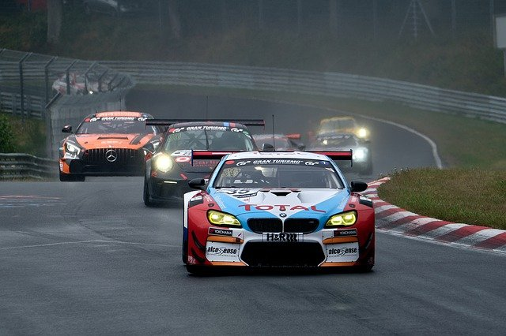

## Лабораторная по компьютерному зрению №2
### matchTemplate
Сопоставление с шаблоном в OpenCVОпубликовано 25.04.2022
Сопоставление с шаблоном — это метод, который используется в OpenCV для поиска расположения шаблона в большем изображении. OpenCV предоставляет для этой цели функцию cv2.matchTemplates(). Она просто накладывает шаблон на входное изображение и сравнивает шаблоны и патч под входным изображением.

Изображение возвращается в градациях серого, где каждый пиксель представляет собой номер окрестности этого пикселя, соответствующий входным шаблонам.


Сопоставление шаблонов в компьютерном зрении — это процесс нахождения меньшего изображения ( шаблона ) в большем изображении. По сути, сопоставление шаблонов использует метод скользящего окна. Окно скользит по исходному изображению (более крупное изображение, в котором мы хотим найти шаблон) при сравнении каждого патча с шаблоном. Патч скользящего окна, который возвращает лучший результат, считается выходом.

В OpenCV у нас есть  cv2.matchTemplate()  метод, который может помочь нам найти определенный шаблон в изображении. В результате возвращается массив NumPy, который содержит изображение в градациях серого, показывающее, насколько соседние пиксели соответствуют шаблону.

Например, взгляните на следующее.

Исходне изображение 



Примтив


После запуска cv2.matchTemplate(), получаем следующий результат.


Как видите, точка, где изображение совпадает с шаблоном, окрашена ярче. Яркая область указывает на хорошее совпадение.

Хорошо! у нас есть изображение в градациях серого. Но как нам двигаться дальше, чтобы локализовать его и нарисовать ограничивающую рамку?

Теперь мы можем использовать cv2.minMaxLoc() чтобы получить минимальное и максимальное значение, а также координаты, указывающие верхний левый и нижний правый углы ограничивающей рамки, которую мы хотим нарисовать. Окончательный результат будет примерно следующим.


### ORB (Oriented FAST and Rotated BRIEF)
Как энтузиаст OpenCV, самое важное в ORB то, что он создан в "OpenCV Labs". Этот алгоритм был предложен Итаном Рубли, Винсентом Рабо, Куртом Конолиге и Гэри Р. Брадски в их статье ORB: эффективная альтернатива SIFT или SURF в 2011 году. Как следует из названия, это хорошая альтернатива SIFT и SURF в вычислениях. стоимость, соответствующие характеристики и, в основном, патенты. Да, SIFT и SURF запатентованы, и вы должны платить им за их использование. А ОРБ нет!!!

ORB представляет собой сочетание детектора ключевых точек FAST и дескриптора BRIEF со многими модификациями для повышения производительности. Сначала он использует FAST, чтобы найти ключевые точки, а затем применяет угловую меру Харриса, чтобы найти N верхних точек среди них. Он также использует пирамиду для создания многомасштабных функций. Но одна проблема заключается в том, что FAST не вычисляет ориентацию. Так что насчет инвариантности вращения? Авторы предложили следующую модификацию.

Он вычисляет взвешенный по интенсивности центроид пятна с расположенным углом в центре. Направление вектора от этой угловой точки к центроиду задает ориентацию. Чтобы улучшить инвариантность вращения, моменты вычисляются с x и y, которые должны находиться в круглой области радиусар, кударэто размер патча.

Теперь для дескрипторов ORB использует дескрипторы BRIEF. Но мы уже видели, что BRIEF плохо работает с вращением. Итак, что делает ORB, так это «направляет» BRIEF в соответствии с ориентацией ключевых точек. Для любого набора функцийнбинарные тесты на месте(Икся,уя), определите2 × пматрица,Скоторый содержит координаты этих пикселей. Затем, используя ориентацию патча,θ, находится его матрица вращения и поворачиваетСполучить управляемую (повернутую) версиюСθ.

ORB дискретизирует угол с шагом2 π/ 30(12 градусов) и построить справочную таблицу предварительно вычисленных шаблонов BRIEF. Пока ориентация ключевой точкиθсогласуется между представлениями, правильный набор точекСθбудет использоваться для вычисления его дескриптора.

BRIEF имеет важное свойство: каждая битовая характеристика имеет большую дисперсию и среднее значение около 0,5. Но как только он ориентируется по направлению ключевой точки, он теряет это свойство и становится более распределенным. Высокая дисперсия делает функцию более различительной, поскольку она по-разному реагирует на входные данные. Другим желательным свойством является некоррелированность тестов, поскольку в этом случае каждый тест будет вносить свой вклад в результат. Чтобы решить все эти проблемы, ORB выполняет жадный поиск среди всех возможных бинарных тестов, чтобы найти те, которые имеют как высокую дисперсию, так и средние значения, близкие к 0,5, а также некоррелированные. Результат называется rBRIEF .

Для сопоставления дескрипторов используется многозондовый LSH, который улучшает традиционный LSH. В документе говорится, что ORB намного быстрее, чем SURF, а SIFT и дескриптор ORB работают лучше, чем SURF. ORB — хороший выбор в маломощных устройствах для сшивки панорам и т. д.

Как обычно, мы должны создать объект ORB с помощью функции cv.ORB() или с помощью общего интерфейса feature2d. Он имеет ряд необязательных параметров. Наиболее полезными из них являются nFeatures, которые обозначают максимальное количество сохраняемых функций (по умолчанию 500), scoreType, который указывает, используется ли оценка Харриса или оценка FAST для ранжирования функций (по умолчанию оценка Харриса) и т. д. Другой параметр, WTA_K, определяет количество баллов. которые создают каждый элемент ориентированного дескриптора BRIEF. По умолчанию это два, т.е. выбираются две точки одновременно. В этом случае для сопоставления используется расстояние NORM_HAMMING. Если WTA_K равно 3 или 4, что требует 3 или 4 точек для создания дескриптора BRIEF, то соответствующее расстояние определяется NORM_HAMMING2.


 Рисуем первые 100 соответсвий.
```
result = cv2.drawMatches(template,kp_template,image,kp_image,matches[:30],None,flags=cv2.DrawMatchesFlags_NOT_DRAW_SINGLE_POINTS)
plt.imshow(result),plt.show()
cv2.imwrite('outputs/100.jpg', result)
```


Записываем первые 10 соответсвий с эталона и исходного изображения
``` 
src_pts = np.float32([kp_template[m.queryIdx].pt for m in matches[:10]]).reshape(-1, 1, 2)
dst_pts = np.float32([kp_image[m.trainIdx].pt for m in matches[:10]]).reshape(-1, 1, 2)
```
Рассчитываем матрицу гомографии
```
h, _ = cv2.findHomography(src_pts, dst_pts)
```

 Трансформируем исходное изображение, используя полученную гомографию
```
 im_out = cv2.warpPerspective(template, h, (image.shape[1],image.shape[0]))
```
```
rectangle_pts = np.float32([[0, 0],
                            [0, template.shape[0]],
                            [template.shape[1], 0],
                            [template.shape[1], template.shape[0]]]).reshape(-1, 1, 2)

rectangle_pts = cv2.perspectiveTransform(rectangle_pts, h).reshape(-1, 2)
```
 Находим углы рамки
```
left_top = [image.shape[1], image.shape[0]]
right_bottom = [0, 0]
```
```
for point in rectangle_pts:
    # Находим левую верхнюю точку рамки
    if point[0] < left_top[0]:
        left_top[0] = point[0] if point[0] >= 0 else 0
    if point[1] < left_top[1]:
        left_top[1] = point[1] if point[1] >= 0 else 0
```
Находим правую нижнюю точку рамки
```    
if point[0] > right_bottom[0]:
        right_bottom[0] = point[0] if point[0] <= image.shape[1] else image.shape[1]
    if point[1] > right_bottom[1]:
        right_bottom[1] = point[1] if point[1] <= image.shape[0] else image.shape[0]
```

 Чтобы рамку было видно у края изображения:
```
left_top = [int(left_top[0]), int(left_top[1])]
if left_top[0] == 0:
    left_top[0] += 10
if left_top[1] == 0:
    left_top[1] += 10

right_bottom = [int(right_bottom[0]), int(right_bottom[1])]
if right_bottom[0] == image.shape[1]:
    right_bottom[0] -= 10
if right_bottom[1] == image.shape[0]:
    right_bottom[1] -= 10
```
Рисуем рамку
```
result = image.copy()
cv2.rectangle(result, left_top, right_bottom, 255, 10)
cv2.imwrite('outputs/resultorb.jpg', result)
```

| Изоражение/ метод            |    matchTemplate    | ORB | 
|------------------------------|:-------------------:|:---:|
| image1(вырезанный фрагмент)  |          +          |  +  | 
| image2(вырезанный фрагмент)  |          +          |  -  |  
| image3 (вырезанный фрагмент) |          +          |  +  | 
| image4 (сторонний фрагмент)  |          -          |  -  | 
| image5 (сторонний фрагмент)  | не корректная рамка |  +  | 
| image6 (сторонний фрагмент)  | не корректная рамка |  +  | 

matchTemplate лучше определяет вырезанный фрагмент из изображения, либо максимально приближенный элемент. Orb больше ошибается на вырезанных фрагментах так как не праильно определяет ключевый точки.
Спиcок литературы 

https://docs.opencv.org/4.x/d1/d89/tutorial_py_orb.html  \
https://docs.opencv.org/3.4/de/da9/tutorial_template_matching.html \
https://debuggercafe.com/template-matching-with-opencv/ \